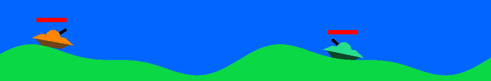
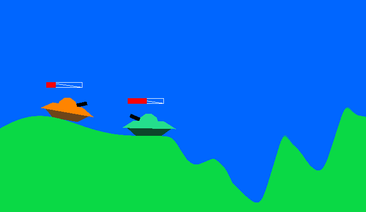

# **Tank Wars 2D - OpenGL Game**

## **Overview**

**Tank Wars** is a **2D tank battle game** built using **OpenGL and C++**. The game features real-time tank combat and collision detection. This project was developed as part of the **Computer Graphics Course (EGC)** at Politehnica University of Bucharest.

## **Features**

- **Player-controlled tanks** with movement and shooting mechanics.

- **Collision detection** between tanks, edge, and projectiles.

- **Basic physics simulation** for projectile motion and tank movement.

- **OpenGL rendering** for real-time graphics.

## **Game Mechanics**

### **Tank Movement**

- Tanks can move **forward, backward, and rotate** the barrel using keyboard controls.

### **Shooting System**

- Tanks can fire **projectiles** that follow a ballistic trajectory.
- Projectiles **collide with tanks**, dealing damage or being destroyed.

## **Installation & Running**

### **Build & Run**

1. **Clone the repository:**
   ```sh
   git clone https://github.com/robertpaulp/Tank-Wars.git   cd Tank-Wars
   ```
2. **Build and Run on Windows:**
    - Install Visual Studio (with "Desktop development with C++" module)
    - Install CMake
    - Open CMake GUI:
      - Set source code path to project root
      - Set build path to `build` directory
      - Click Configure and Generate
      - Click "Open Project" to launch Visual Studio
    - In Visual Studio:
      - Build and Run the solution

    Note: Source code for the Tank Wars game is located in `src/lab_m1/Tank_Wars/`

## **Controls**

- **Player 1** 

| Action              | Key   |
| ------------------- | ----- |
| Move Forward        | W     |
| Move Backward       | S     |
| Rotate Barrel Left  | A     |
| Rotate Barrel Right | D     |
| Fire Projectile     | Space |

- **Player 2**

| Action              | Key         |
| ------------------- | ----------- |
| Move Forward        | Up Arrow    |
| Move Backward       | Down Arrow  |
| Rotate Barrel Left  | Left Arrow  |
| Rotate Barrel Right | Right Arrow |
| Fire Projectile     | Enter       |

## **Game Screenshots**


